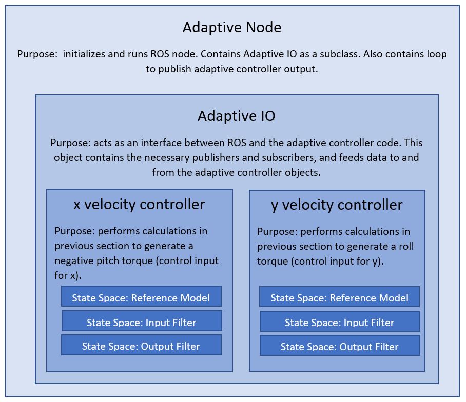

# REEF Adaptive Control
The REEF Adaptive Control is a ROS package which contains a non-linear MRAC controller for multi-rotors implemented in C++. The controller is intended to be used with the [REEF Estimator](https://github.com/uf-reef-avl/reef_estimator), [REEF Control](https://github.com/uf-reef-avl/reef_control) and an altered version of the [ROSFlight](https://github.com/uf-reef-avl/torque_flight) packages. This node does not replace the PID controllers in the REEF Control package but rather augments the existing control law to reduce the reduce the error the the desired state. 

Currently, the controller is set to control body-level frame X and Y velocities by implementing two individual and independent adpative controllers. 
## Prerequisites
Tested and run on Ubuntu 18.04 with ROS Melodic. 

Depends on:

- ROSFlight (altered version)
- reef_msgs 

## Installation 
```asm
mkdir -p adpative_ws/src
cd adaptive_ws/src
catkin_init_workspace
git clone https://github.com/uf-reef-avl/reef_adaptive_control
git clone https://github.com/uf-reef-avl/torque_flight
git clone https://github.com/uf-reef-avl/reef_msgs
cd torque_flight
git submodule update --init --recusive 
cd ../..
catkin build
```

## Running the node
Please use the existing launch file included in the package. It has been tested with using velocity measurements from the motion capture system (although the launch file will allow you to run the node with measurements from RGB-D inputs).

| Topic Name    | Type                           | Purpose                                                                                      |
|---------------|--------------------------------|----------------------------------------------------------------------------------------------|
| desired_state | reef_msgs/DesiredState         | Desired state coming either from a higher-level controller or a gamepad eg. Xbox Controller  |
| Total Torque  | torque_flight_msgs/TotalTorque | Output of ROSFlight's attitude/attitude rate PID controller                                  |
| XYZ_Estimate  | reef_msgs/XYZEstimate          | Output of REEF Estimator containing estimates of body-level velocities                       |

Publishes the /added_torque topic which is subscribed by the edited ROSFlight node.
## Background

 

The REEF adaptive controller was developed to overcome the change in the CG of the aerial vehicle between flights which occured mainly due to not having a consistent placement for the batteries. Since the batteries are one of the heaviest components in our setup, slight mis-aligning the battery tends to make the vehicle to drift when controlling using a PID velocity controller. To overcome this, an adaptive controller is used to _adapt_ to the changing CG to prevent the vehicle from drifting. 

### Initialization


## Tuning
The controller can be tuned by adjusting the reference model and the adaptive gain. 
### Reference model Constraints: 
The reference model must be both stable and minimum phase. This means all numerator and denominator coefficients must be greater than zero.
The reference model needs to have a relative degree of one. That is, the degree of the numerator must be one more than the degree of the denominator.
In order to ensure the model settles to the same value as the reference input, the model should have a DC gain of unity. This implies the first coefficients of the numerator and denominator are equal, and the limit as s approaches zero is one.
The reference model should have the same degree as the true system. For lateral velocity, this is a third order system. For height, this is a second order system, and for yaw rate, this is a first order system.
### Adaptive Gain Tuning
The adaptive gain must be a positive value. Higher values allow the system to adapt and respond faster, but can lead to oscillations and instability. If oscillation occurs, disable adaptation and try again with a lower gain.

### Dynamic Tuning
Dynamic tuning has been used in our lab in order to tune the controller gains while the vehicle is in flight. When using this, please exercise caution as drastic changes to certain gains can lead to crashes. 

The dynamic tuning uses the yaml parameters as the default values. Hence the gains are launched using a namespace which is the SAME as the name of the node (refer to launch file). If this is NOT the case all the gains will be set to the default value in the [configure](./cfg/Gains.cfg) file. Please refer to the [tutorial](http://wiki.ros.org/dynamic_reconfigure/Tutorials/HowToWriteYourFirstCfgFile) for the dynamic configure for more details.


## Code Structure



## TODO
- Make the node compatible with getting velocity estimates from the RMEKF node and relative_nav messages
- Added a yaw rate controller to _adapt_ to yaw rate commands
